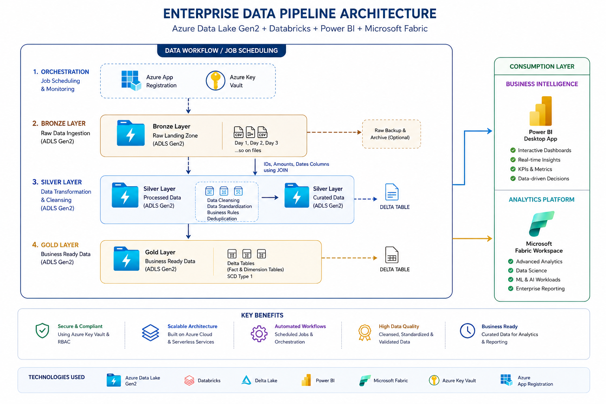
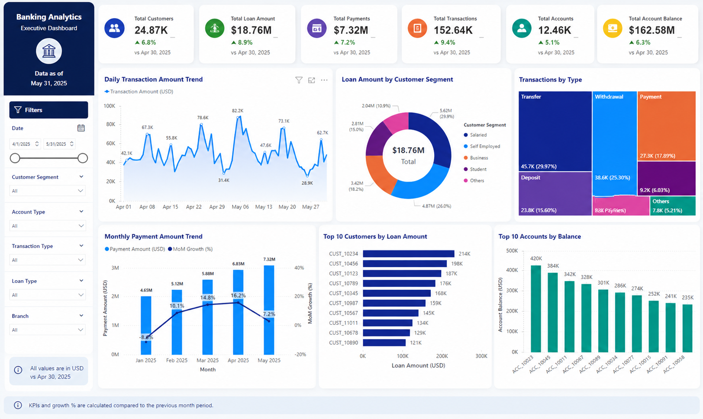

# Enterprise Banking Data Pipeline using Azure Databricks & Delta Lake

## Overview

Designed and implemented an enterprise-grade data engineering solution to process large-scale banking datasets including customer accounts, loan information, transactions, and payment records. This project demonstrates end-to-end expertise in building scalable cloud-native ETL/ELT pipelines using the Azure ecosystem and Databricks.

The solution follows a modern Medallion Architecture (Bronze, Silver, Gold) with Delta Lake for reliable ACID-compliant storage and optimized analytical processing. The final curated datasets are integrated with Power BI to deliver business insights and reporting capabilities.

---

## Architecture Diagram



---

## Key Business Use Cases

- Centralized ingestion of banking and financial datasets
- Incremental processing of transaction and payment data
- Standardized transformation and cleansing framework
- Historical dimension handling using SCD Type 1 implementation
- Reporting-ready curated datasets for business analytics
- Automated orchestration and workflow scheduling

---

## Technology Stack

### Cloud & Storage
- Microsoft Azure
- Azure Data Lake Storage Gen2 (ADLS Gen2)
- Azure Key Vault

### Data Engineering & Processing
- Azure Databricks
- PySpark
- Spark SQL
- Delta Lake
- Delta MERGE Operations

### Orchestration & Monitoring
- Azure Databricks Workflows
- Parameterized Notebook Execution

### Reporting & Visualization
- Power BI
- Databricks SQL Warehouse

---

## Solution Architecture

The project is designed using a layered Medallion Architecture approach:

### Bronze Layer – Raw Data Ingestion

Raw CSV files containing:
- Customer Data
- Account Information
- Loan Details
- Payment Records
- Transaction Data

are ingested into ADLS Gen2 in a date-partitioned structure.

**Storage Pattern:**

```bash
/bronze/YYYY/MM/DD/*.csv
```

### Silver Layer – Data Cleansing & Standardization

Transformation logic includes:

- Null handling and validation
- Data type standardization
- Duplicate record removal
- Schema enforcement
- Derived column generation
- Data quality checks

Processed datasets are stored in optimized Parquet/Delta format.

### Gold Layer – Business Ready Data Model

The Gold layer contains curated analytical datasets optimized for reporting and dashboard consumption.

Key implementation features:

- SCD Type 1 implementation using Delta MERGE
- Incremental updates
- Optimized Delta tables
- Aggregated business metrics
- Reporting-ready schemas

---

## ETL Workflow

### Step 1: Data Ingestion
- Ingested raw CSV datasets into ADLS Gen2
- Implemented date-wise partitioning strategy
- Secured storage access using Azure Key Vault secrets

### Step 2: Data Transformation
- Performed cleansing and standardization using PySpark
- Applied reusable modular transformation functions
- Implemented schema validation and quality checks

### Step 3: Delta Processing
- Converted transformed datasets into Delta format
- Implemented SCD Type 1 merge operations using Delta Lake
- Optimized tables for analytical workloads

### Step 4: Reporting Integration
- Connected Databricks SQL Warehouse with Power BI
- Built interactive dashboards for business reporting
- Enabled near real-time analytical reporting

---

## Dashboard Preview



---

## Power BI Reporting Insights

The reporting layer provides insights into:

- Customer transaction trends
- Loan disbursement analysis
- Payment tracking and monitoring
- High-value customer accounts
- Transaction volume analytics
- Financial activity trends

---

## Key Engineering Features

### Scalable Data Processing
- Distributed data processing using Spark
- Optimized transformations for large datasets
- Partition-based ingestion strategy

### Delta Lake Implementation
- ACID transaction support
- Reliable MERGE operations
- Schema evolution support
- Improved performance and consistency

### Secure Data Handling
- Secret management using Azure Key Vault
- Secure access configuration for storage layers

### Production-Oriented Design
- Modular notebook structure
- Reusable transformation logic
- Workflow scheduling support
- Error handling and logging strategy

---

## Project Highlights

- Built end-to-end Azure data engineering pipeline
- Implemented Medallion Architecture using Delta Lake
- Designed scalable ETL framework with PySpark
- Developed SCD Type 1 incremental loading process
- Integrated Databricks with Power BI for analytics
- Automated workflows using Databricks Jobs

---

## Connect With Me

- LinkedIn: https://www.linkedin.com/in/aniketh8/

---

## Repository Reference

Original project reference and README context provided by the user: fileciteturn0file0

